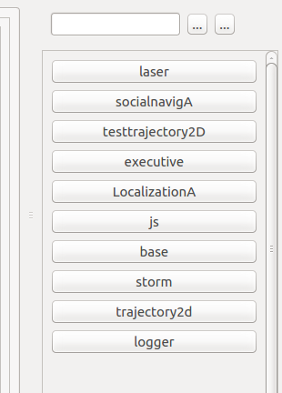

# 11th June, 2018

# Adding component lists

Hola everyone ! This is Mayank joining Robocomp again this year for developing the RCManager project and hopefully finishing off with atleast a beta usable version of this tool.

Note - Newcomers to this blog are advised to go through my previous year GSoC details [here](https://robocomp.github.io/web/gsoc/2017/index) for a recap on this project.

My first task was to add a fully functioning component list for RCManager. The component list is a vital tool for navigating through huge component graphs. Each component is represented as a button in this list, which dynamically changes as and when new components are added or existing ones are removed. Following is a screenshot of the component list.

On clicking a button, the RCManager automatically highlights/selects the corresponding component. Technically, it should also pan the main window to that component. Things seems to work quite well till here, but problems began as I started to implement the auto-pan feature.

In order to appreciate the complexities of this feature, we need to understand the co-ordinate system used by Python Qt. On the main window, the user observes two things. 

* **QtScene** - The main underlying widget is the QtScene, which can be considered as the big canvas holding the entire component graph in it. The size of the canvas is determined at object initialization, and may change if we zoom in/out on the main window. 

* **QtView** - On top of the QtScene, we have the second widget called the QtView. The QtView is like a windowpane which shows us a part of the bigger QtScene. The size of the QtView is dependant on how you resize the entire RCManager window (maximize/minimize). The following image illustrates this structure. The QtView, for example, is depicted by the theatre window, while the larger movie screen is the QtScene.

Both the QtView and the QtScene have their own co-ordinate systems, and the Qt framework provides functions to map points to and from the QtScene co-ordinates. Our xml files contain the positions mentioned in an absolute QtScene co-ordinate plane, which causes troubles when we either resize the QtScene or the QtView.

The solution to this problem is dynamically scaling the component positions as and when the QtScene is resized. Let us say that a component is placed at (200, 200) in a 400x400 QtScene. If you zoom in, the QtScene gets enlarged to say 800x800. The new component position should be updated to (400, 400), since both axes were doubled in size. This sort of gives a relative feel to the points rather than an absolute value. We are currently working on revising the co-ordinate system of our components.

Component list abstractions - To add or remove elements from the component list, you can use the following functions residing in viewer.py. Do make sure that the components exist before you use either of the following functions.

* add_to_component_list (name of the node in string format)
* remove_from_component_list (name of the node in string format)

This part of my project also fixed a few bugs related to the pinging of the components, in order to check whether they are working or not. However, this feature is expected to see a few more bugs, which will be fixed as and when they are reported. 

Till we meet next, adios.

* * * 
[Mayank Kumar](https://github.com/Kmayankkr/)

Email - kr.mayank1997@gmail.com
sss
